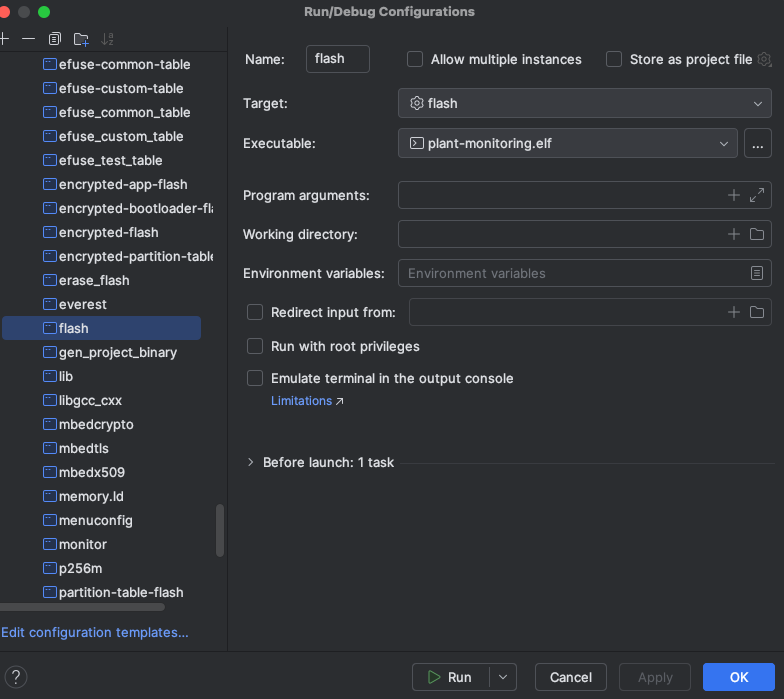
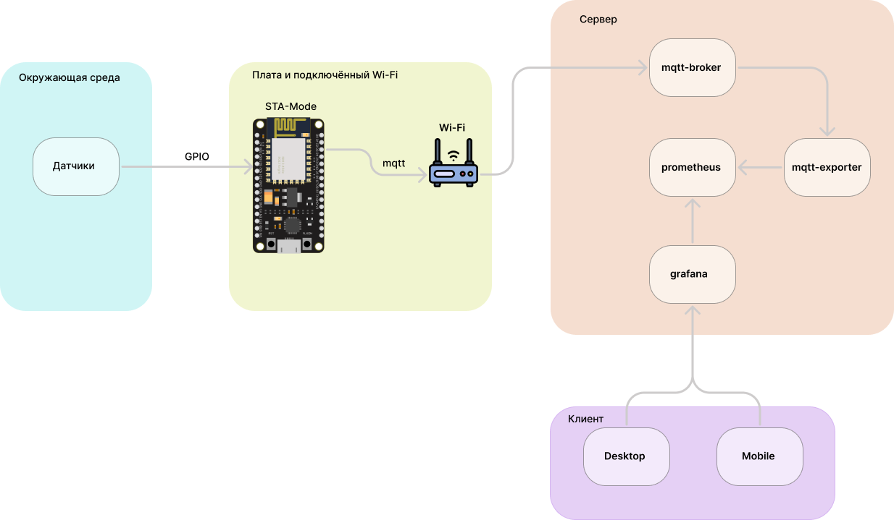
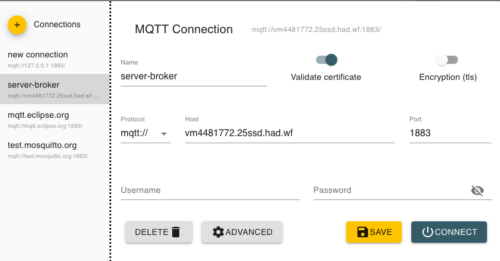

# Система мониторинга состояния комнатного растением

### Тулчейн

Для разработки проекта использовался фреймворк idf-esp в IDE CLion.
Настройка проекта и среды для разработки в CLion:
- [Дока esp-idf](https://docs.espressif.com/projects/esp-idf/en/stable/esp32/get-started/windows-start-project.html)
- [Введение в ESP-IDF(RUS)](https://www.youtube.com/watch?v=CDBqYCwWD0c&t=1133s)
- [Введение в ESP-IDF(ENG)](https://www.youtube.com/watch?v=1o9zASOxZaQ)
- [CLion ESP-IDf](https://www.jetbrains.com/help/clion/esp-idf.html)


### Прошивка и отладка

При разработке в CLion общий конфиг в дереве проект - sdkconfig, кастомные переменные(например настройка Wi-Fi) туда нужно переносить самостоятельно. 
Локальные конфиги Kconfig.projbuild - в проекте не импортируются автоматически. 

Для прошивки платы используется конфигурация - flash с заданным elf файлом:



Команда для запуска отладки - мониторинга:
```shell
cd ~/esp/esp-idf && . ./export.sh && cd ~/esp/plant_monitoring_project && idf.py monitor
```
#### Примечания

Фреймворк esp-idf установлен в пути: `~/esp`

Проект расположен в пути: `~/esp/plant_monitoring_project`

Выйти из режима отладки можно с помощью комбинации `CTRL` + `]`

Без IDE с плагином esp-idf можно попробовать выполнить следующие команды:
```shell
idf.py -p 1220 flash monitor # загрузка + отладка, номер порта можно увидеть подлючив плату esp и написав команду  ls /dev/tty.*.
```

### Библиотеки для работы с перефирией

В проекте использовалась [Библиотеки](https://github.com/UncleRus/esp-idf-lib) esp-idf включающая в себя драйверы дял работы 
с периферией.
- [Настройка](https://github.com/UncleRus/esp-idf-lib/tree/master/examples/dht/default) dht-драйвера (!Важно - подключать необходимо имена на порт GPIO-4, иначе может вылететь ошибка драйвера)

## Структура проекта

В проекте использовались следующие датчики:
- [DHT11](https://www.electronicoscaldas.com/datasheet/DHT11_Aosong.pdf) - температура/влажность [С, %]
- [HC-SR04](https://www.handsontec.com/dataspecs/HC-SR04-Ultrasonic.pdf) - ультразвуковой датчик, измеряющий расстояние [м] ([принципиальная схема](https://arc.net/l/quote/vssgoycj))
- [TEMT6000](https://learn.sparkfun.com/tutorials/temt6000-ambient-light-sensor-hookup-guide/all) - освещённость [люкс]
- [YL-69](https://www.electronicoscaldas.com/datasheet/YL-69-HL-69.pdf) - влажность почвы [%]

Алгоритм работы:
1. Микроконтроллер снимает показания с датчиков по соответствующим портам GPIO
2. Микроконтроллер с помощью встроенного Wi-Fi модуля отправляет эти метрики в формате JSON по протоколу [mqtt](https://mqtt.org/) на сервер
3. На сервере с помощью утилиты [mqtt-exporter](https://github.com/kpetremann/mqtt-exporter) метрики экспортируются в [prometheus](https://prometheus.io/docs/introduction/overview/)
4. Prometheus используется в качестве источника данных в [grafana](https://grafana.com/) и таким образом метрики появляются на борде



#### STA

Station mode(STA) - режим работы, при котором устройство ESP32 подключается к существующей сети Wi-Fi,
функционируя как клиент. В этом режиме ESP32 не создает свою собственную сеть,
а вместо этого использует доступ к уже имеющейся точке доступа (например, роутеру) для
обмена данными с другими устройствами в сети.

## Mqtt-Broker

### Пример отправки метрик mqtt-брокеру

Пример отправки метрик температуры и влажности mqtt-брокеру без авторизации в формате JSON:

host = vm4481772.25ssd.had.wf:1883
mqtt_topic = esp32/plant_monitoring/metrics

```bash
# Задаем переменную хоста
HOST="vm4481772.25ssd.had.wf:1883"

# Определяем JSON данные
DATA='{\"temperature\":90.25,\"humidity\":46.37, \"crit_debug\":0.0}'

# Определяем топик
TOPIC="esp32/plant_monitoring/metrics"

# Формируем команду mosquitto_pub
COMMAND="mosquitto_pub -L mqtt://$HOST/$TOPIC -m \"$DATA\""

# Выполняем команду
eval "$COMMAND"
```
Для удобства скрипт выделен в отдельный [файл](send_to_mqtt_broker.sh).
Для валидирования доставки отправки метрик можно воспользоваться MQTT-Explorer.

Настройки MQTT-explorer:



Во вкладке advanced подпишитесь на топик /esp32/plant_monitoring/metrics и удалите топик SYS.

## Деплой

Для деплоя сервиса был арендован виртуальный сервер.
ПО протоколу **ssh** c помощью утилиты **scp** была рекурсивна перенесена директория [deploy](deploy) c помощью команды

```shell scp -r deploy root@ip-address:~/esp```

Деплой включает в себя следующие сервисы:
- mosquitto-exporter - экспортирует метрики
- prometheus - бд для хранения метрик
- grafana - сервис отображения метрик
- alertmanager - сервис настройки алертов

## Мониторинг

Дэшборд графаны выглядит следующим образом:

Доступ к системе мониторинга датчиков:
- [grafana](http://vm4481772.25ssd.had.wf:3000/d/ce3f4anwhavpce/plant-monitoring?from=now-15m&to=now&timezone=browser)
- [prometheus](http://vm4481772.25ssd.had.wf:9090/graph?g0.expr=sensor_temprature&g0.tab=1&g0.display_mode=lines&g0.show_exemplars=0&g0.range_input=1h)
- [alertmanager](http://vm4481772.25ssd.had.wf:9093/#/alerts)