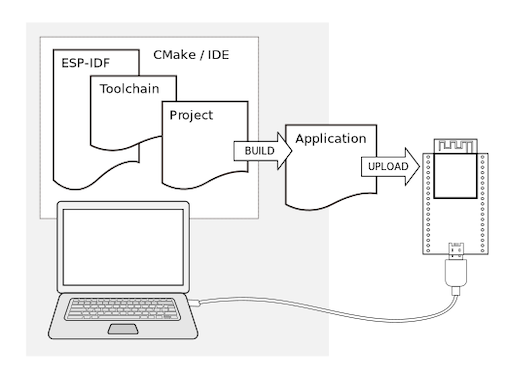

# Система мониторинга за комнатным растением

Для разработки проекта использовался фреймворк idf-esp.
Настройка проекта и среды для разработки в CLion:
- [Дока esp-idf](https://docs.espressif.com/projects/esp-idf/en/stable/esp32/get-started/windows-start-project.html)
- [Введение в ESP-IDF(RUS)](https://www.youtube.com/watch?v=CDBqYCwWD0c&t=1133s)
- [Введение в ESP-IDF(ENG)](https://www.youtube.com/watch?v=1o9zASOxZaQ)



При разработке в CLion локальные конфиги Kconfig.projbuild - не импортируются в настройки автоматически. 
Процесс разработки идёт через sdkconfig и их нужно переносить самостоятельно.

Команда для запуска отладки:
```shell
cd ~/esp/esp-idf && . ./export.sh && cd ~/esp/plant_monitoring_project && idf.py monitor
```

Пример отправки метрик mqtt-брокеру без авторизации в формате JSON:

host = vm4481772.25ssd.had.wf:1883
mqtt_topic = esp32/plant_monitoring/metrics

```shell
mosquitto_pub -L mqtt://vm4481772.25ssd.had.wf:1883/esp32/plant_monitoring/metrics -m "{\"temperature\":26.25,\"humidity\":46.37}"
```
Station mode(STA) - режим работы, при котором устройство ESP32 подключается к существующей сети Wi-Fi, 
функционируя как клиент. В этом режиме ESP32 не создает свою собственную сеть, 
а вместо этого использует доступ к уже имеющейся точке доступа (например, роутеру) для 
обмена данными с другими устройствами в сети.

idf.py -p 1220 flash monitor - загрузка + отладка порт можно увидеть подлючив плату esp и написав команду.


## Примечания

Фреймворк esp-idf установлен в пути: `~/esp`

Проект расположен в пути: `~/esp/plant_monitoring_project`

Выйти из режима отладки можно с помощью комбинации `CTRL` + `]`

### Библиотеки для работы с перефирией

[Библиотеки](https://github.com/UncleRus/esp-idf-lib) esp-idf

- [Настройка](https://github.com/UncleRus/esp-idf-lib/tree/master/examples/dht/default) dht-драйвера

Доступ к системе мониторинга-аналитики:
- [grafana](http://vm4481772.25ssd.had.wf:3000/d/ce3f4anwhavpce/plant-monitoring?from=now-15m&to=now&timezone=browser)
- [prometheus](http://vm4481772.25ssd.had.wf:9090/graph?g0.expr=sensor_temprature&g0.tab=1&g0.display_mode=lines&g0.show_exemplars=0&g0.range_input=1h)
